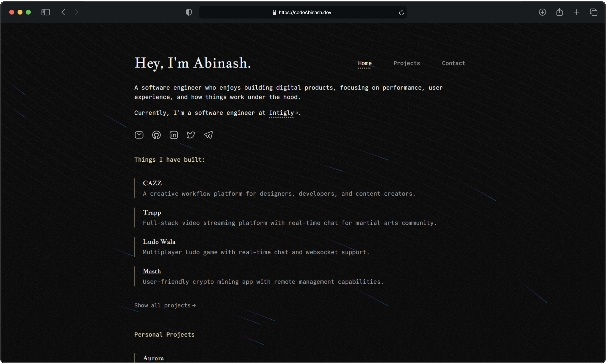

## About Me

I am a software engineer with a passion for web development. I love to create things that make people's lives easier. Whether it is a web application, mobile application, or a command line tool, I love to create them.

- B.Tech in Computer Science and Engineering
- 3+ years of experience in Web Development
- Currently working as a part time freelancer

Please visit my
<a target="_blank" href="https://codeAbinash.vercel.app">Portfolio</a> to see some of my projects.

## Get in Touch

I'm always excited to connect with fellow developers, researchers, and technology enthusiasts. You can reach out to me through:

- Email: [codeAbinash@gmail.com](mailto:codeAbinash@gmail.com) 📧
- LinkedIn: [codeAbinash](https://www.linkedin.com/in/codeAbinash) 💼
- Twitter: [@codeAbinash](https://twitter.com/codeAbinash) 🐦

Feel free to contact me for collaboration opportunities, discussions, or any questions you may have.
